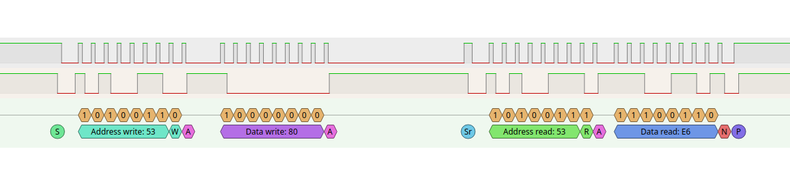
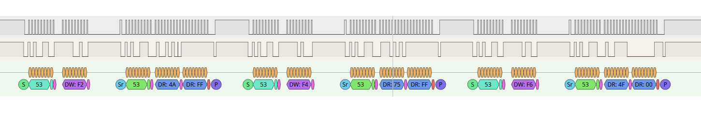
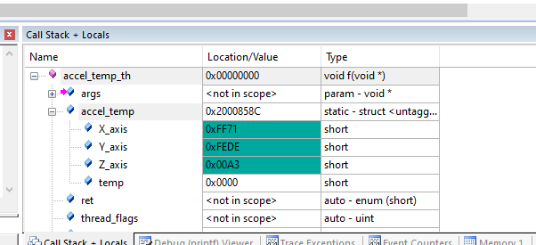
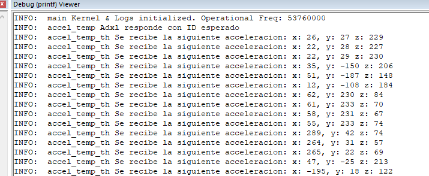

# Explicacion del Codigo de Acelerometro y Temperatura

El codigo implementa la lectura de un accelerometro adxl346 usando el microcontrolador STM32F429ZI

---

## **Componentes Principales**

1. *Biblioteca ADXL34x*: Esta biblioteca incluye todas las funciones necesarias para configurar y manipular el accelerometro.
2. *Modulo accel_temp*: 
* Inicializa el periferico I2C a traves de la HAL de CMSIS
* Inicilaiza un temporizador del OS, que ejecuta un callback una vez por segundo. El callback asi mismo indica al hilo principal que debe realizar una nueva lectura a traves de un flag
* El hilo principal del modulo, recibe una vez por segundo el flag de inicio de lectura. Entonces usando las funciones que provee la biblioteca *ADXL34x* (escrita por mi) hace 3 lecturas a los distintos registros donde se encuentran la acceleracion de los ejes *X*, *Y* y *Z*
* El sensor se configura para tener una sensibilidad de +-2G, y una frecuencia de sampleado de 100Hz.

## Imagenes

### Lectura de ID del sensor

### Lectura de acceleraciones

 
