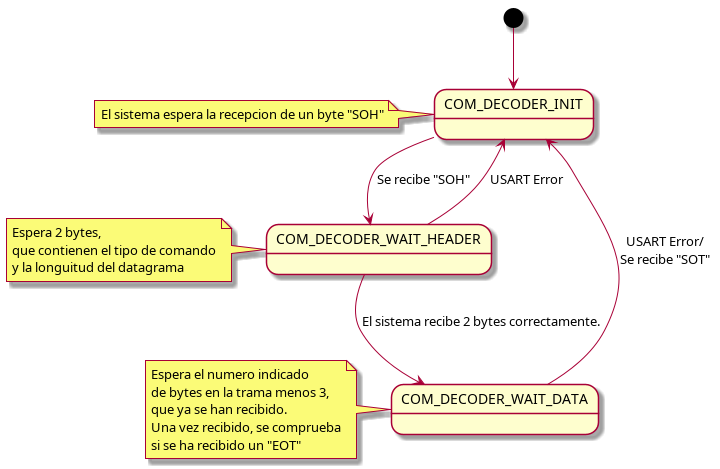

# Explicacion del Codigo COM

Los ficheros com.c y com.h implementan una maquina de estados junto con sus funciones de inicializacion.

---

## **Componentes Principales**

### 1. "Inicializacion de task COM"
La funcion *init_com_proc_* inicializa un hilo que hace uso del Periferico USART3 del microcontrolador.
Comprueba que los parametros de entrada (cola de mensaje para recibir *rxqueue*  y enviar *txqueue* sean introducidos. Ademas comprueba que el proceso no estuviera inicializado de antes.

### 2. "Proceso COM"
El proceso COM hace uso de una maquina de estados para la recepcion de datagramas con un formato especifico. Ademas permite a otros hilos enviar mensajes por el periferico USART3, usando el mismo formato de datagrama.
### 2.1 "Maquina de estados
Los estados de la maquina de estados son:
* *COM_DECODER_INIT*: En este estado, la maquina solo espera un unico byte, el de inicio de trama **"SOH"**. Si es recibido, se pasa al siguiente estado **COM_DECODER_WAIT_HEADER**
* *COM_DECODER_WAIT_HEADER*: Se comprueba que no se haya producido ningun error, como por ejemplo un timeout. En caso de no haberse producido ningun error, por la estructura del datagrama, ya tenemos la longuitud total del mensaje, configuramos el periferico USART para recibir la longuitud especificada menos 3 bytes que ya hemos recibido y pasamos al siguiente estado de la maquina de estados, **COM_DECODER_WAIT_DATA**.
* *COM_DECODER_WAIT_DATA*: Se comprueba si no se comete ningun error, y si el ultimo byte recibido es el byte indicativo de final de trama **"EOT"** En caso de que el datagrama se haya formado correctamente, se envia por la cola de mensaje *rxqueue*
En caso de producirse cualquier error, se pone la maquina de estados de vuelta a **COM_DECODER_INIT** 

--- 
## **Diagrama de maquina de estados**

