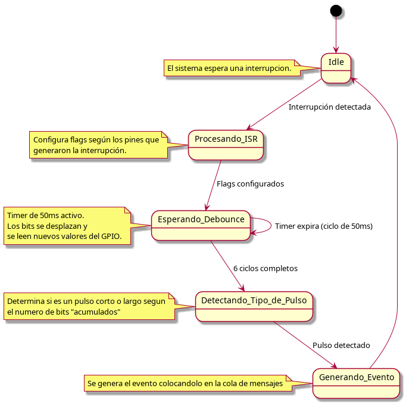

# Explicación del Código del Joystick

El código implementa el control de un joystick de la placa MBED usando un microcontrolador STM32F429. Este joystick tiene cinco direcciones (arriba, abajo, izquierda, derecha y centro) que generan interrupciones cuando se presionan. A continuación, se describen los componentes principales del código.

---

## **Componentes Principales**

### 1. **Interrupción (ISR)**
Cuando se detecta una interrupción en los pines del joystick, la función `joystick_isr` identifica qué dirección fue presionada y configura **flags** asociadas. Los flags notifican al hilo central de joystick.c que se ha detectado un pulso en uno de los pines asociados al joystick.

### 2. **Debounce y Filtrado**
Un **timer de 50ms** verifica continuamente los estados de los pines del joystick. En cada ciclo:
- Los valores pasados de los pines son desplazados a la izquierda, introduciendo en el bit menos significativo (LSB) el nuevo valor.
- Con este metodo se debouncea los cinco pines del joystick sin consumir demasiado tiempo de procesamiento en el hilo del joystick.

### 3. **Generación de Eventos**
Una vez se desplazan los bits 6 veces, se comprueba en el hilo principal si se produjo una pulsacion corta o larga, dependiendo del numero de bits que se han activado durante las 6 medidas. El Bit mas significativo indica que pin produjo la interrupcion.

### 4. **Máquina de Estados**
El flujo lógico del joystick sigue una máquina de estados que incluye los siguientes pasos:
- **Idle**: Espera una interrupción.
- **Procesando ISR**: Establece banderas según la interrupción.
- **Esperando Debounce**: Inicia el timer y desplaza bits.
- **Detectando Tipo de Pulso**: Decide si es un pulso corto o largo.
- **Generando Evento**: Crea un evento y regresa a Idle.

---

## **Diagrama de la Máquina de Estados**

---

Es un sistema eficiente para manejar  debouncing y asegura que cada movimiento del joystick sea correctamente interpretado.

Basado en la implementacion de [Jack Ganssle (link)](https://www.ganssle.com/debouncing-pt2.htm)
